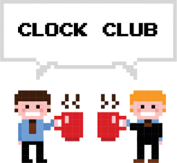

# Welcome to the club

A collection of community-shared Clockwise themes for the Canvas clockface is known as




Don't forget, pull requests with new themes are welcome here!


## Running locally
To create/update the themes locally, we need to run a Python server in your local machine where the Clockwise will make the requests to. The server script is located into the local/ folder and the descriptor files (JSON) must be placed in the root of this folder. The step-by-step to run it locally is:
- Clone this repo
- Go to the Settings page and change the `[Canvas] Server Address` to your local IP, let's say 192.168.3.19 for example.
- Also, change the `[Canvas] Description file` to point to the desired file, let's say `hello-world`. It means that a hello-world.json file must be in the local/ folder.
- Run the server using `python local-server.py` into the folder `local/` and it will log something similar to this:
```
Creating SSL Server on local IP 192.168.3.19 and port 4443 
Please, put the same IP address in the card called '[Canvas] Server Address' in the settings page of Clockwise
Serving '/'...
```
- After that, restart the Clockwise and it will be able to download the hello-world.json locally. You can see that every time a request is made to the python server is logged on terminal.
- To rollback the changes, just revert the `[Canvas] Server Address` to `raw.githubusercontent.com` and `[Canvas] Description file` to one of the descriptors in the shared/ folder

### Pre-requisites
It necessary Python 3 installed, follow the tutorials to install it for [Linux](https://python-guide-pt-br.readthedocs.io/pt_BR/latest/starting/install3/linux.html) or [Windows](https://python-guide-pt-br.readthedocs.io/pt_BR/latest/starting/install3/win.html)

## Questions

Feel free to open an issue with questions.
